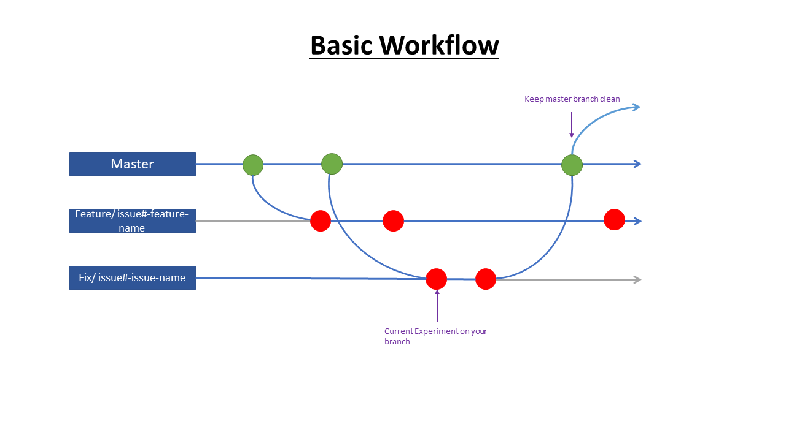

# CONTRIBUTING.md #
Here you can find some basic rules for working on this project. They should keep this repository clean and save us some headaches. **Please get familiar with these rules** so everyone is on the same page and we spend less time fiddling with unwanted git states.
For coding guidelines see [CODING.md](./CODING.md)

## Git ##
When setting up your work environment (i.e. your editor of choice, pyenv, etc.) and prior to your first commits check your local repository for any unwanted system specific files/folders (e.g. lockfiles, configfiles specific to your system, etc.) either manually or by running `git status` and browsing through the untracked files. Update the `.gitignore` file with the filenames or a fitting RegEx to prevent all unwanted files from being accidentally added to the (remote) repository.

### Branching strategy ###
This project uses the GitHub Flow strategy for branching (for more information see [GitHub Flow Guide](https://guides.github.com/introduction/flow/)).
The main branch should always be deployable so all work should be done on the dedicated branches. This ensures that there is no broken/unfinished code on the main branch. Every new branch should be created from the current main branch to ensure that the development is based on _a) the current state of the project_ and _b) functioning code_.
- **feature:** Every new feature gets developed in its own branch named `feature/{issue#-descriptive-feature-name}`.
- **fixes:** Bugfixes (not typos etc.) get developed in a respective branch named `fix/{issue#-descriptive-issue-name}`
- **the following flow chart shows a basic workflow**

Following this strategy should make it easy to understand the history of the project and revert changes if necessary.

### General rules for working on the repo ###
1. Avoid working directly on the main branch
2. Checkout the respective branch of the part you are working on when beginning your workday
3. Get your local repository up to date with the remote repo before you start working by pulling
4. Push to the remote repository regularly (at least every time you are done working for the day)
5. Use descriptive commit messages
6. Structure your commits logically, i.e. by changed class/script/part of a feature
7. Try to avoid using ``git commit -a [...]`` altogether or at least check your working tree for unwanted files by running ``git status``
8. When a feature is finished, issue a merge request so other team members know that you are done and have the chance to review your work before the branch is merged to main
9. Only merge to main when the feature/fix is finished and your code runs/passes tests
